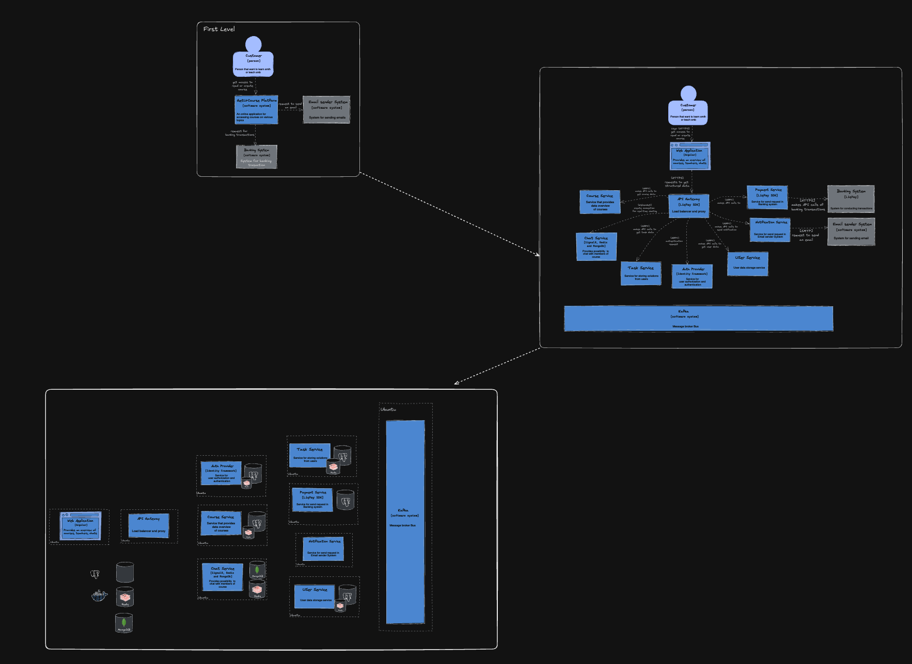

# Проектування архітектури та деталізоване проектування

## Архітектура
Для проекту було обрано мікросервісну архітектуру мікросервіси. Це підхід, коли єдиний додаток будується як сукупність невеликих, самодостатніх, незалежних, не тісно зв’язаних сервісів, що спілкуються між собою за допомогою легких механізмів як то HTTPs, gRPC, Kafka. Ці сервіси побудовані навколо бізнес-потреб (кожен відповідальний за конкретний процес) та розгортаються незалежно з використанням повністю автоматизованого середовища. Існує абсолютний мінімум централізованого управління цими сервісами. Самі по собі сервіси можуть бути написані на різних мовах і використовувати різні технології зберігання даних.

## Причини використання
Причини використання :  
- Масштабованість: Кожен мікросервіс можна масштабувати окремо залежно від навантаження.  

- Незалежність розробки та розгортання: Команди можуть працювати над різними сервісами незалежно одна від одної. Це прискорює розробку, тестування і розгортання нових функцій без необхідності переписувати або переробляти всю систему.

- Висока надійність: У разі збою одного з мікросервісів (наприклад, сервісу чату), інші сервіси (курси, оплати) продовжать працювати. Це підвищує загальну надійність системи.

- Гнучкість у виборі технологій: Кожен мікросервіс можна розробляти з використанням найбільш відповідних для його завдань технологій. 

- Спрощення підтримки та оновлень: Оновлення одного мікросервісу не вимагає перезапуску всієї системи, що мінімізує простій під час обслуговування та оновлень.

- Легка інтеграція з зовнішніми системами: Мікросервіси, такі як платіжний або email-сервіс, можуть легко інтегруватися із зовнішніми API, що спрощує роботу з банківськими системами та сервісами надсилання повідомлень.  

## Діаграми 

Для опису діаграм системи було обрано c4 модель 

### Загальний вигляд

#### Легенда

### Перший рівень

Ця діаграма ілюструє взаємодію між основними компонентами на першому рівні системи:

- Користувач (Customer) — це людина, яка бажає навчитися або викладати. Користувач має можливість отримати доступ до платформи для читання або створення курсів.
- GetUrCourse Platform — це основна програмна система, яка надає доступ до курсів і дозволяє користувачам створювати або переглядати курси з різних тем.
- Email Sender System — програмна система, яка відповідає за надсилання електронних листів. Платформа відправляє запити на цю систему для надсилання повідомлень користувачам.
- Banking System — система для здійснення банківських транзакцій. Платформа взаємодіє з цією системою для проведення фінансових операцій, таких як оплата курсів.

### Другий рівень

На цій діаграмі зображено детальнішу архітектуру системи, де користувач взаємодіє з різними сервісами через веб-застосунок:

- Web Application — забезпечує інтерфейс для користувачів, де вони можуть переглядати курси, спілкуватися з викладачами і використовувати чат.
- API Gateway — шлюз, що приймає всі запити від веб-застосунку і пересилає їх відповідним сервісам.
- Course Service — сервіс, який надає детальний огляд курсів.
- Chat Service — сервіс для спілкування користувачів між собою за допомогою чатів.
- Task Service — відповідає за зберігання рішень користувачів щодо завдань.
- Auth Provider — сервіс аутентифікації користувачів.
- Payment Service — сервіс для проведення банківських транзакцій через систему Liqpay.
- Notification Service — сервіс для надсилання повідомлень через MailJet.
- User Service — сервіс для зберігання даних користувачів.

Ці компоненти взаємодіють через API Gateway, забезпечуючи високий рівень масштабованості та ізольованості мікросервісів.

### Третій рівень

Ця діаграма описує інфраструктурні аспекти архітектури:

- Web Application, API Gateway, і різні сервіси розміщені на окремих серверах або контейнерах (Docker).
- Course Service, Chat Service, Task Service та інші сервіси використовують бази даних для зберігання даних (PostgreSQL, Redis, MongoDB).
- Kafka — використовується як шина повідомлень для обміну даними між сервісами.
- Auth Provider, Payment Service, і Notification Service також інтегровані з відповідними базами даних і зовнішніми системами для забезпечення безпеки, фінансових операцій і повідомлень.
